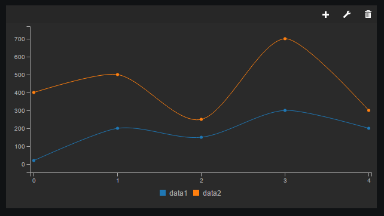

# Freeboard widget for C3
Widget for creating [C3 charts](http://c3js.org/)

# Note
This is still a WIP and some functions might not work!

# Usage

Add the script to your html file and you are ready to go!
All that you need to get going is some data, this goes in the `CHART COLUMNS` input.

	[
		['data1', 20, 200, 150, 300, 200],
		['data2', 400, 500, 250, 700, 300],
	]

